<h1 align="center">
  Hi 👋, I'm Mahboob Ali
</h1>

<div align="center">
  
</div>


<p align="center">
  <a href="https://github.com/MahboobAli1/MahboobAli1">
    
  </a>
  


<h2 align="center">💫 About Me</h2>

<table>
<tr>

<td width="50%">

- 🎓 AI Student from Pakistan  
- 🤖 Passionate about Artificial Intelligence & Machine Learning  
- 📚 Currently learning Deep Learning, NLP, LLMs & Computer Vision  
- 🚀 Building real-world AI projects  
- 💡 Goal: Become a Professional AI Engineer  

</td>

<td width="50%">


</td>

</tr>
</table>

<!-- =========================
      CONNECT WITH ME
========================= -->

<h2 align="center">🌐 Connect With Me</h2>

<p align="center">
  Let’s connect and build something amazing 🚀
</p>

<div align="center">

<a href="https://github.com/MahboobAli1">
  
</a>

<a href="https://www.linkedin.com/in/mahboob-ali-ai-expert/">
  
</a>

<a href="mailto:mahboobalilaghari1976@gmail.com">
  
</a>
<a href="https://youtube.com/@aiwithmahboobali?si=VdrFAKTHVp4q6CoK" target="_blank">
  
</a>

</div>


<h2 align="center">📊 Mahboob's GitHub Stats</h2>

<p align="center" style="background:#0d1117; padding:20px; border-radius:20px;">
  
</p>

<table align="center">
  <tr>
    <td>
      
    </td>
  </tr>
  <tr>
    <td>
      
    </td>
  </tr>
  <tr>
    <td>
      
    </td>
  </tr>
  <tr>
    <td>
      
    </td>
  </tr>
</table>

# 💻 Tech Stack

## Languages
<p align="center">
  
  
  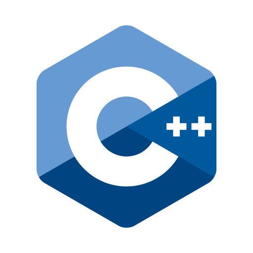
  
  
  
  
  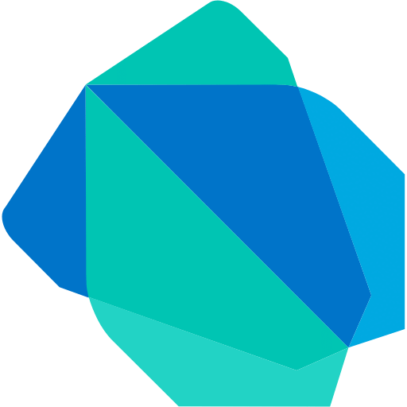
</p>

---

## AI / ML
<p align="center">
  
  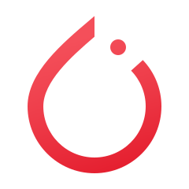
  
  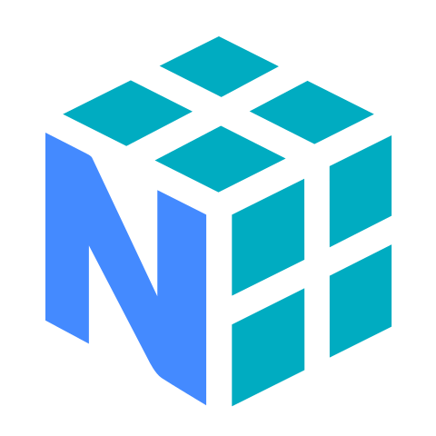
  
  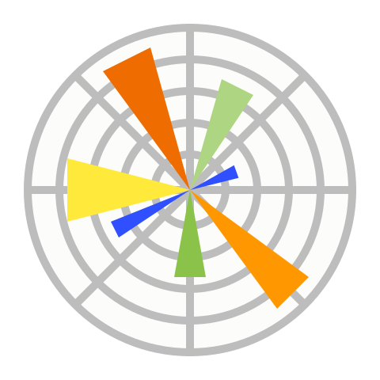
  
</p>

---

## Tools / IDEs
<p align="center">
  
  
  
  
  
</p>

---

## Databases
<p align="center">
  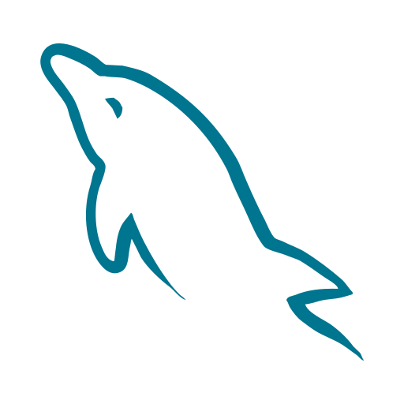
  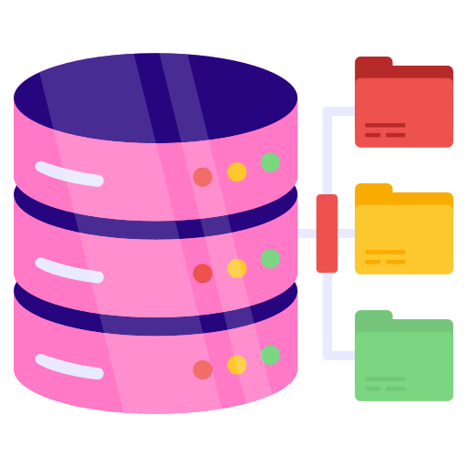
</p>

---

## Frameworks / Platforms
<p align="center">
  
  
  
 
</p>

---

## Operating System
<p align="center">
  
</p>

---

## Office Tools
<p align="center">
  
  
  
</p>

---

## Version Control & Cloud
<p align="center">
  
  
</p>
# 🔥 GitHub Streak

<div align="center">


</div>

---

# 📈 Contribution Graph


---


```diff

+@ @ @ @ @ @ @ @ @ @ @ @ @ @ @ @ @ @ @ @ @ @ @ @ @ @ @ @+
@@       o o                                           @@
@@       | |                                           @@
@@      _L_L_                                          @@
@@   ❮\/__-__\/❯  A habit missed once is a mistake,    @@
@@   ❮(|~o.o~|)❯  A habit missed twice is the start     @@
@@   ❮/ `-'/ \❯       of a new habit!                  @@
@@     _/`U'\_                                         @@
@@    ( .   . )     .----------------------------.     @@
@@   / /     \ \    | while (!(success = try())) |     @@
@@   \ |  ,  | /    '----------------------------'     @@
@@    \|=====|/                                        @@
@@     |_.^._|                                         @@
@@     | |"| |                                         @@
@@     ( ) ( )   Testing leads to failure              @@
@@     |_| |_|   and failure leads to understanding    @@
@@ _.-' _j L_ '-._                                     @@
@@(___.'     '.___)                                    @@
+@ @ @ @ @ @ @ @ @ @ @ @ @ @ @ @ @ @ @ @ @ @ @ @ @ @ @ @+
```
  
</div>


<h2 align="center">📜 Certificates</h2>

<div align="center">

<!-- Google AI -->
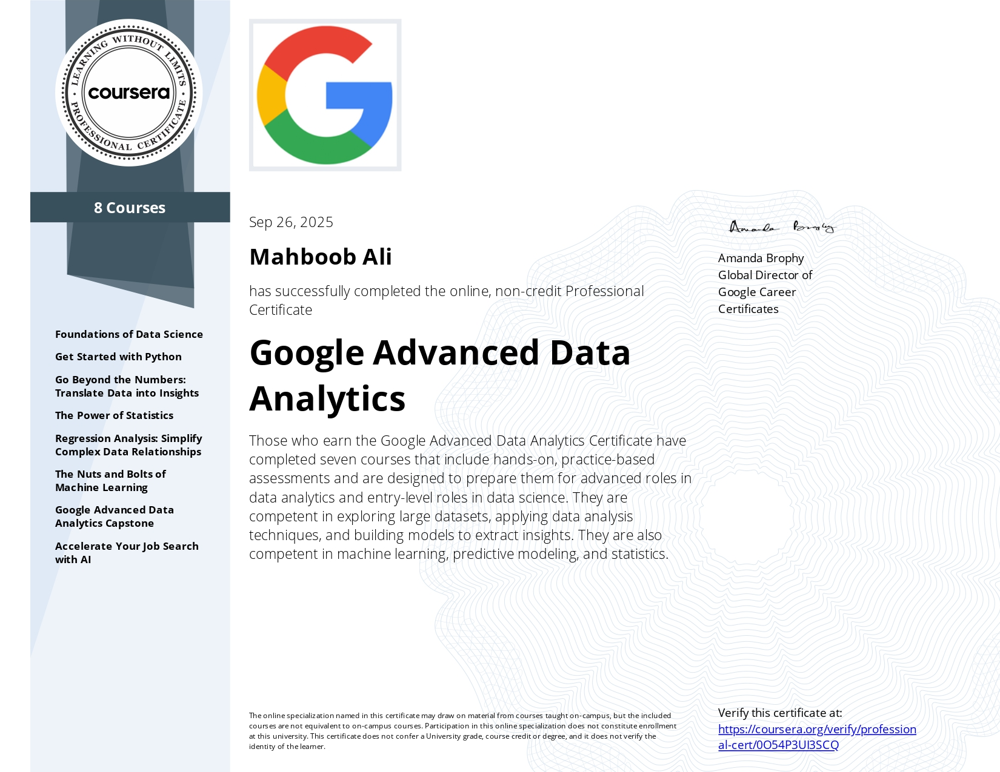

<!-- DSTP -->


<!-- IBA Test -->
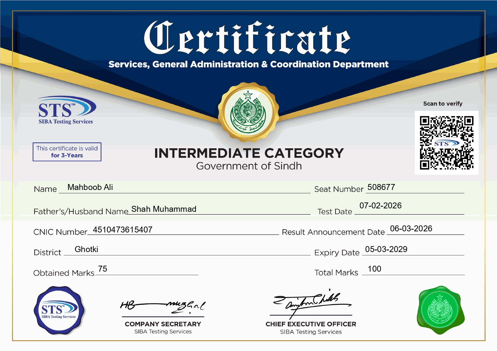

<!-- Mahboob Ali Certificate -->
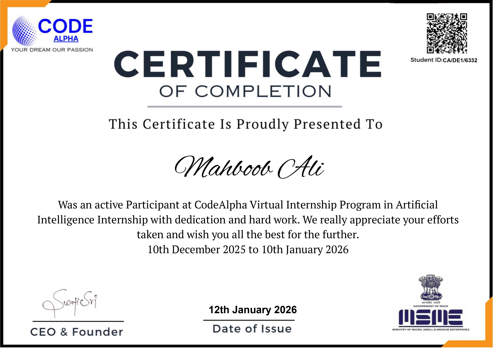

<!-- Google AI (Personal) -->
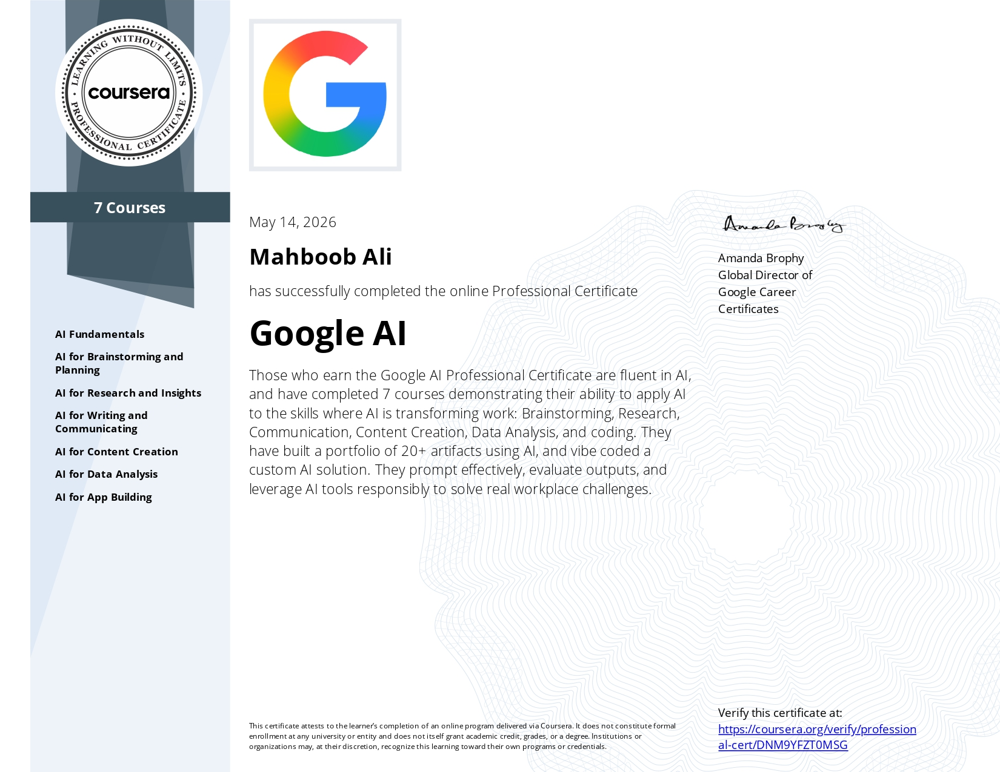

</div>
<h2 align="center">🚀 Featured Projects</h2>

<div align="center">
<table border="1" cellpadding="8" cellspacing="0">

  <tr>
    <td><b>Crop Recommendation System</b></td>
    <td>Python / AI</td>
    <td>4th Semester</td>
    <td>Recommends suitable crops based on soil and environmental data</td>
  </tr>

  <tr>
    <td><b>ML Pipeline with Scikit-learn</b></td>
    <td>Python / ML</td>
    <td>4th Semester</td>
    <td>End-to-end pipeline with preprocessing, model training (Logistic Regression, Random Forest), GridSearchCV tuning, and deployment using joblib</td>
  </tr>

</table>
</div>
---

# ⚡ Quote

“It always seems impossible until it’s done.” — Nelson Mandela

---

<div align="center">

## 💖 Thanks for Visiting

⭐ Star my repositories if you like my work!

</div>
